# Bool-Market
Data Science Final Project Batch 1327

# Candlesticks Explained

## Single Candlesticks

### Doji
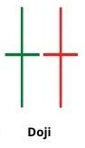

**Characterised by:** the opening and closing price being the same.

**Signifies:** indecision in the market. If it occurs in and uptrend or a downtrend, it means the trend is likely to reverse.

**Logic:** 20 * ABS(O - C) <= H - L

### Dragonfly Doji

**Characterised by:** the same open, close and high price during the trading window. It is the bullish version of the Gravestone Doji.

**Signifies:** resistance of buyers and their attempts to push the market up.

**Logic:** 50 * ABS(O - C) <= H - L AND STOC1 >= 70 AND H - L >= AVGH10 - AVGL10 AND L = MINL10

### Gravestone Doji
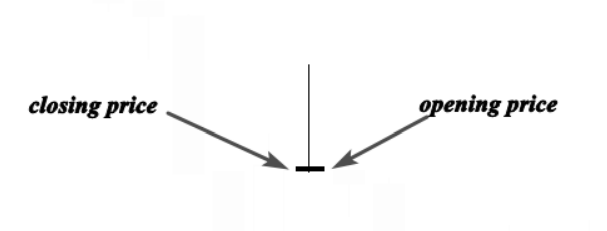
**Characterised by: ** very similar opening, closing, and low prices during the tradin window.

**Signifies:** The long upper shadow is an indication that the market is testing a powerful supply or resistance area.

**Logic:** 100 * ABS(O - C) <= H - L AND STOC1 <= 5 AND H > L AND 10 * L <= 3 * H1 + 7 * L1 AND H - L >= AVGH10-AVGL10

### Hammer
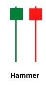
**Characterised by:** a short body, and long lower shadows.

**Signifies:** That sellers were unsuccessful in their attempt to push the price lower. When at the bottom of a downtrend, it signifies a reversal.

**Logic:** 5 * ABS(C - O) <= H - L AND 10 * ABS(O - C) >= H - L AND 2 * O >= H + L AND STOC1 >= 50 AND (20 * O >= 19 * H + L OR STOC1 >= 95) AND 10 * (H - L) >= 8 * (AVGH10 - AVGL10) AND L = MINL5 AND H > L

### Spinning Top / Bottom
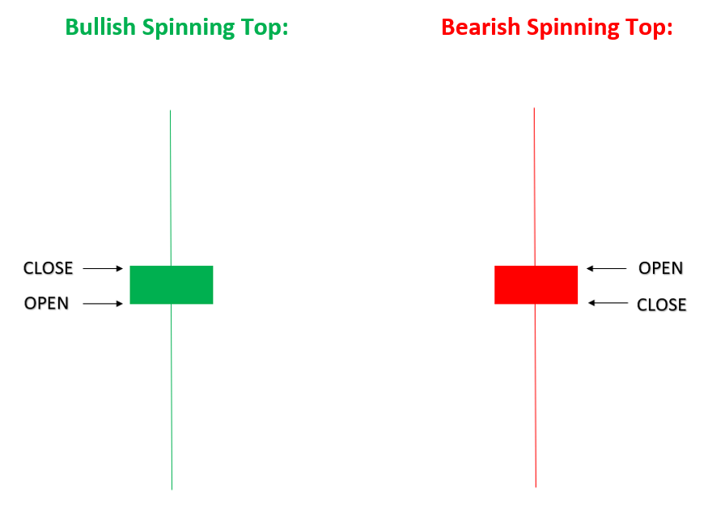
**Characterised by:** a short body, but with shadows that are at least twice the size of the body.

**Signifies:** That both buyers and sellers tried to push the price, but that it closed close to the opening price.

**Logic:** ABS(C - O) / (H - L) < BodyThreshold AND MAX(O, C) - L > ShadowThreshold AND H - MIN(O, C) > ShadowThreshold

### Marubozo

**Characterised by:** a body with no high or low shadows.

**Signifies:** An extremely strong buying or selling pressure in the previous trading period.

**Logic:** H - L = ABS(O - C) AND H - L > 3 * AVG(ABS(O - C), 15) / 2

#### Opening Marubozu
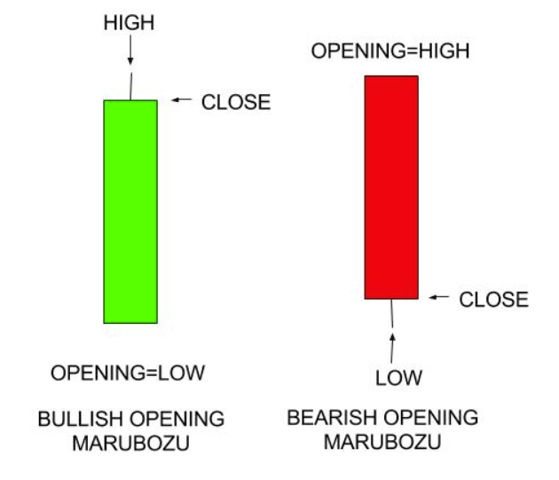
**Characterised by:** the opening price occurring at the high or low of the trading window.

**Signifies:** That as soon as the bell rang, the bears or the bulls took charge and pushed the prices in the direction for the rest of the window.

**Logic:** (L = O OR O = H) AND H - L > ABS(O - C) AND ABS(O - C) > 3 * AVG(ABS(O - C), 15) / 2

#### Closing Marubozu
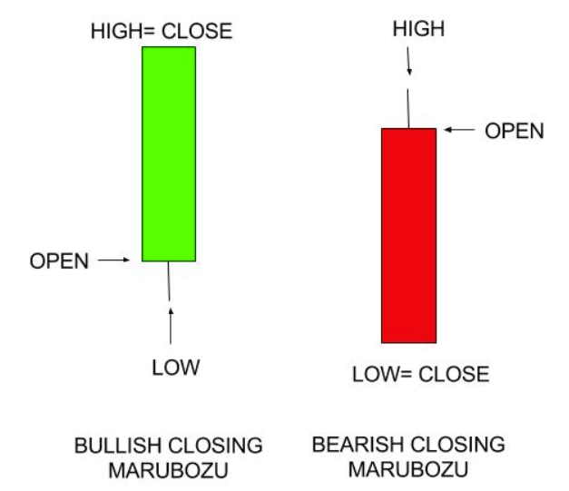
**Characterised by:** the closing price being either the high or the low for the trading window.

**Signifies:** That not only did the prices maintain the move in a single direction after initial jitters, in fact the participants maintained the sentiments until the end moment of the trading window.

**Logic:** (L = C OR C = H) AND H - L > ABS(O - C) AND ABS(O - C) > 3 * AVG(ABS(O - C), 15) / 2

## Double Candlesticks

### Bearish Engulfing Bar Pattern
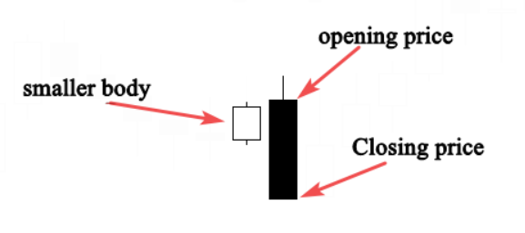
**Characterised by:** two candlesticks, where the second candlestick's body engulfs the previous one.

**Signifies:** That sellers are in control of the market. When it occurs at the end of an uptrend, it indicates buyers are engulfed by sellers which signals a trend reversal.

**Logic:** O1 > C1 AND 10 * (C - O) >= 7 * (H - L) AND C > O1 AND  C1 > O AND 10 * (H - L) >= 12 * (AVGH10 - AVGL10)

### Bullish Engulfing Bar Pattern

**Characterised by:** two candlesticks, where the second candlestick's body engulfs the previous one.

**Signifies:** That the  sellers are no longer in control of the market, and buyers will take control. When it occurs at the end of a downtrend, the reversal is more powerful as it represents a capitulation bottom.

**Logic:** O1 > C1 AND 10 * (C - O) >= 7 * (H - L) AND C > O1 AND  C1 > O AND 10 * (H - L) >= 12 * (AVGH10 - AVGL10)

### Harami Pattern
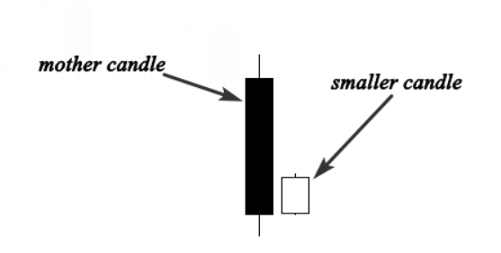
**Characterised by:** A large first candle (the mother) followed by a smaller second candle (the baby). The second candle should close outside the previous one.

**Signifies:** TBuyers and sellers don't know what to do, and there is no one in control od the market. The market is consolidating. It is considered a bearish reversal signal when it occurs at the top of an uptrend, and a bullish signal when it occurs at the bottom of a downtrend.

**Logic:** 10 * (O1 - C1) >= 7 * (H1 - L1) AND H1 - L1 >= AVGH10.1 - AVGL10.1 AND C > O AND O > C1 AND O1 > C AND 6 * (O1 - C1) >= 10 * (C - O)

### Tweezer Bottom Pattern
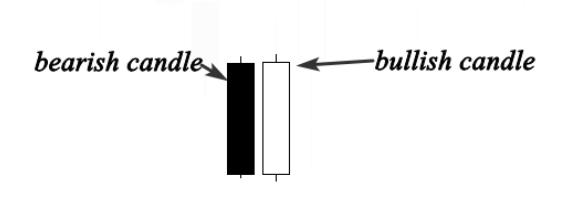
**Characterised by:** A bearish candlestick followed by a bullish candle.

**Signifies:** The Tweezer Bottom happens during a downtrend, when sellers push the market lower, but the next session the price closes above or roughly at the same price od the first bearish candle, which indicates that buyers are coming to reverse the market direction. This is a bullish reversal pattern seen at the bottom of a downtrend.

**Logic:** L = L1 AND 5 * ABS(C - O) < ABS(C1 - O1) AND 10 * ABS(C1 - O1) >= 9 * (H1 - L1) AND 10 * (H1 - L1) >= 13 * (AVGH20 - AVGL20)

### Tweezer Top Pattern
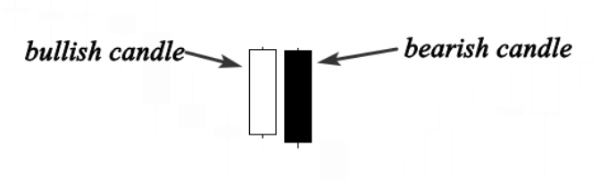
**Characterised by:** A bullish candlestick followed by a bearish candle.

**Signifies:** The tweezers top occurs during an uptrend when buyers push the price higher, but sellers surprised buyers by pushing the market lower and close down the open of the bullish candle.

If this price action happens near a support level, it indicates that a bearish reversal is likely to happen.

**Logic:** H = H1 AND ABS(C - O) < .2 * ABS(C1 - O1) AND ABS(C1 - O1) >= .9 * (H1 - L1) AND H1 - L1 >= 1.3 * (AVGH20 - AVGL20)

## Triple Candlesticks

### Morning Star Pattern
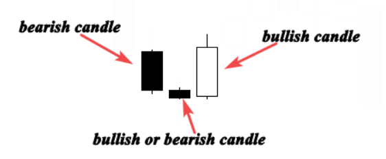
**Characterised by:** A first bearish candlestick, a second smaller candle which can be bullish or bearish, and a third, bullish candle that closes above the midpoint of the body of the first trading window.

**Signifies:** The first candle indicates sellers are still in charge of the market.
The second candle represents that sellers are in control, but they don't push the market much lower.
The third candle holds a significant trend reversal.

Together, it shows how buyers took control of the market from sellers.

When this pattern occurs at the bottom of a downtrend near the support level, it is interpreted as a powerful trend reversal signal.

**Logic:** O2 > C2 AND 5 * (O2 - C2) > 3 * (H2 - L2) AND C2 > O1 AND 2 * ABS(O1 - C1) < ABS(O2 - C2) AND H1 - L1 > 3 * (C1 - O1) AND C > O AND O > O1 AND O > C1

### Evening Star Pattern
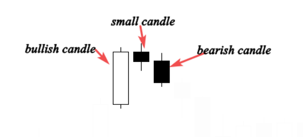
**Characterised by:** A first, bullish candle.
This is followed by a small candle which can be bullish, bearish, Doji, or any other.
The third candle is a large, bearish candle. 

**Signifies:** The first candle indicates that bulls are still pushing the market higher.
The second candle shows that buyers are in control, but they are not as powerful as they were.
The third candle shows that the buyer's domination is over, and a possible bearish trend reversal is likely.

**Logic:** C2 - O2 >= .7 * (H2 - L2) AND H2 - L2 >= AVGH10.2 - AVGL10.2 AND C1 > C2 AND  O1 > C2 AND H - L >= AVGH10 - AVGL10 AND O - C >= .7 * (H - L) AND O < O1 AND O < C1

### Three Inside Up Pattern
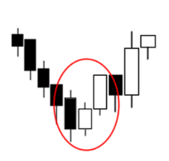
**Characterised by:** Composed by a large down candle, a smaller up candle contained with the previous candle, and then a third candle that closes above the close of the second candle.

**Signifies:** A bullish reversal pattern.

**Logic:** 10 * (O2 - C2) >= 7 * (H2 - L2) AND (H2 - L2) >= AVGH10.2 - AVGL10.2 AND C1 > O1 AND O1 > C2 AND C1 < O2 AND 5 * (C1 - O1) <= 3 * (O2 - C2) AND O > O1 AND O < C1 AND C > C1 AND 10 * (C - O) >= 7 * (H - L)

### Three Inside Down Pattern
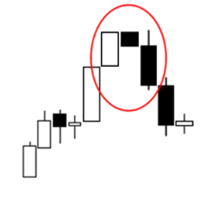
**Characterised by:** Composed by a large up candle, a smaller down candle contained with the previous candle, and then a third down candle that closes below the close of the second candle.

**Signifies:** A bearish reversal pattern.

**Logic:** ABS(C2 - O2) > .5 * (H1 - L1) AND C2 > O2 AND C1 < O1 AND H1 < C2 AND L1 > O2 AND C < O AND C < C1

### Three Black Crows
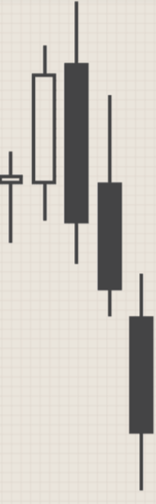
**Characterised by:** Three consecutive bearish candles at the end of a bullish trend. 

**Signifies:** A shift in control from the bulls to the bears.

**Logic:** O1 < O2 AND O1 > C2 AND O < O1 AND O > C1 AND C1 < L2 AND C < L1 AND C2 < 1.05 * L2 AND C1 < 1.05 * L1 AND C < 1.05 * L

### Three White Soldiers
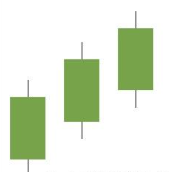
**Characterised by:** Three consecutive long-bodied candlesticks that open within the precious cansle's real body and a close that exceeds the previous candle's high.

**Signifies:** A shift in control from the bulls to the bears.

**Logic:** C > C1 AND C1 > C2 AND C > O AND C1 > O1 AND C2 > O2 AND 2 * ABS(C2 - O2) > H2 - L2 AND 2 * ABS(C1 - O1) > H1 - L1 AND H - L > AVGH21 - AVGL21 AND O > O1 AND O < C1 AND O1 > O2 AND O1 < C2 AND O2 > O3 AND O2 < C3 AND 20 * C > 17 * H AND 20 * C1 > 17 * H1 AND 20 * C2 > 17 * H2

## Other Candlestick Patterns

### Bearish / Bullish Breakaway

**Characterised by:** A first, long candle.
A second, third and fourth candle which must be spinning tops.
A fifth candle must be a long candle which closes within the body gap of the first two candles.

**Signifies:** A reversal in the trend.

**Bearish Logic:** ABS(C4 - O4) > .5 * (H4 - L4) AND C4 > O4 AND C3 > O3 AND L3 > H4 AND C2 > C3 AND C1 > C2 AND C < O AND L < H4 AND H > L3

**Bullish Logic:** C4 < O4 AND 2 * ABS(C4 - O4) > H4 - L4 AND C3 < O3 AND H3 < L4 AND C2 < C3 AND C1 < C2 AND 5 * ABS(C - O) > 3 * (H - L) AND C > O AND C > H3